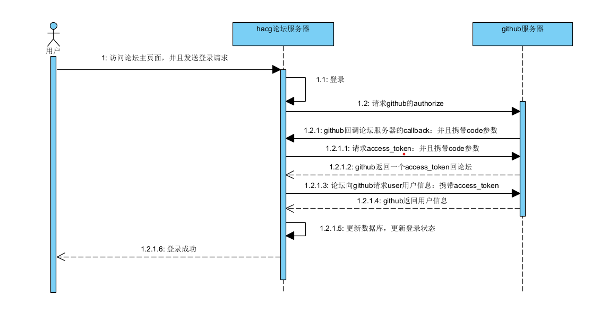
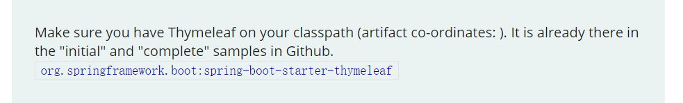

##  Hacg Community

##  框架

后端框架：springboot

数据库：mysql

UI框架：bootstrap

登录功能：GitHub-API

##  资料

[考开源项目地址](https://github.com/codedrinker/community)

[springboot开发指导文档](https://spring.io/guides)

[gitHubApi登录功能网址](https://docs.github.com/cn/developers/apps/building-oauth-apps/creating-an-oauth-app)

[gitHubApi授权APP实现教程](https://docs.github.com/cn/developers/apps/building-oauth-apps/authorizing-oauth-apps)

[bootstrap资料地址](https://v3.bootcss.com/components/)

[vim-pc版安装教程](https://blog.csdn.net/weixin_54363263/article/details/120790827)

[vim编辑器的命令](https://blog.csdn.net/weixin_54363263/article/details/120790827)

[bootstrap资料地址](https://v3.bootcss.com/components/)

[vim-pc版安装教程](https://blog.csdn.net/weixin_54363263/article/details/120790827)

[vim编辑器的命令](https://blog.csdn.net/weixin_54363263/article/details/120790827)

[ssh添加教程](https://blog.csdn.net/cider_m/article/details/122868407)

[maven仓库](https://www.mvnrepository.com)

##  工具

[visual Paradigm](https://www.visual-paradigm.com)

[vim-pc版github地址](https://github.com/vim/vim-win32-installer/releases)

[okHttp地址](https://square.github.io/okhttp/)

## github授权APP登录流程图

## 常见问题

#### 1、为什么手动布置web应用是，无法访问到html页面，报404错误

#### 2、为什么连接第三方github获取access_token令牌时，会爆出证书错误
[解决方案](https://blog.csdn.net/gabriel576282253/article/details/81531746/)

